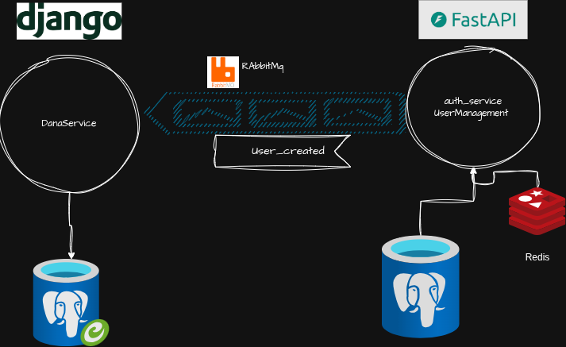

# DanaJoyan

## project setup

1- compelete cookiecutter workflow (recommendation: leave project_slug empty) and go inside the project
```
cd DanaJoyan
```

2- SetUp venv
```
virtualenv -p python3.10 venv
source venv/bin/activate
```

3- install Dependencies
```
pip install -r requirements_dev.txt
pip install -r requirements.txt
```

4- create your env
```
cp .env.example .env
```

5- Create tables
```
python manage.py migrate
```

6- spin off docker compose
```
docker compose -f docker-compose.dev.yml up -d
```

7- run the project
```
python manage.py runserver
```


8: run that consumer
```
 python manage.py consume_user_events
```

## Endpoints

### Companies

| Method | Endpoint | Description |
|--------|----------|-------------|
| GET | `/api/transport/companies/` | List all companies |
| POST | `/api/transport/companies/` | Create new company |
| GET | `/api/transport/companies/{id}/` | Get company details |
| PUT/PATCH | `/api/transport/companies/{id}/` | Update company (author only) |
| DELETE | `/api/transport/companies/{id}/` | Delete company (author only) |

### Buses
| Method | Endpoint | Description |
|--------|----------|-------------|
| GET | `/api/transport/buses/` | List all buses |
| POST | `/api/transport/buses/` | Create new bus |

### Seats
| Method | Endpoint | Description |
|--------|----------|-------------|
| GET | `/api/transport/seats/` | List all seats |
| POST | `/api/transport/seats/` | Create new seat |

### Transport (Trips)
| Method | Endpoint | Description |
|--------|----------|-------------|
| GET | `/api/transport/transport/` | List trips (with filters & pagination) |
| POST | `/api/transport/transport/` | Create new trip |


## System Architecture


